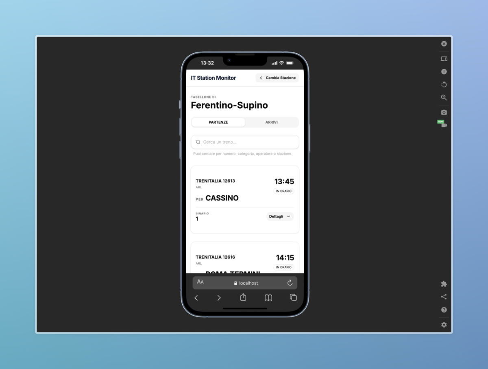

# 🚆 Italian Live Train Monitor (RFI/Trenitalia)

A fast, modern, and mobile-first web application to check real-time train departures and arrivals for Italian railway stations. Built with **Astro**, **React**, and **Tailwind CSS**, and optimized for edge-rendering on **Cloudflare Pages**.



## ✨ Features

- **Real-Time Data**: Live train statuses, delays, and platform numbers fetched directly from RFI (Rete Ferroviaria Italiana).
- **Smart Search**: Lightning-fast station search with autocomplete and keyboard navigation support.
- **Recent Stations**: Automatically saves your most searched stations locally for quick access.
- **Mobile-First & Responsive**: Designed to look like a native iOS/Android app on mobile, expanding into a beautiful grid dashboard on desktop.
- **Edge Optimized**: Server-Side Rendering (SSR) powered by Cloudflare, ensuring blazingly fast load times and API caching.
- **Dark Mode Ready**: Fully implemented with semantic variables using shadcn/ui.

## 🛠️ Tech Stack

- **Framework**: [Astro](https://astro.build/) (Server-Side Rendering)
- **UI Library**: [React](https://reactjs.org/)
- **Styling**: [Tailwind CSS](https://tailwindcss.com/)
- **Components**: [shadcn/ui](https://ui.shadcn.com/)
- **Icons**: [Lucide React](https://lucide.dev/)
- **Deployment**: [Cloudflare Pages](https://pages.cloudflare.com/)

## 🚀 Getting Started

To run this project locally, you'll need Node.js installed on your machine.

### 1. Clone the repository

```bash
git clone https://github.com/herecomesfed/it-station-monitor.git
cd rfi-monitor
npm install
npm run dev
```

The app will be available at `http://localhost:4321`.

## 📦 Deployment (Cloudflare Pages)

This project is configured to run on Cloudflare Pages using the `@astrojs/cloudflare` adapter.

1. Connect your GitHub repository to Cloudflare Pages.
2. Use the following build settings:
   - **Framework preset**: Astro
   - **Build command**: `npm run build`
   - **Build output directory**: `dist`
3. _Optional but recommended_: Set up a **Cache Rule** in your Cloudflare Dashboard for the `/api/*` path to respect origin headers (`s-maxage`). This will cache API responses at the edge and prevent hitting rate limits.

## 🤝 Contributing

Contributions, issues, and feature requests are welcome! Feel free to check the [issues page](https://github.com/herecomesfed/it-station-monitor/issues).

## 📄 License

This project is licensed under the MIT License - see the [LICENSE](LICENSE) file for details.

---

_Disclaimer: This project is an independent tool and is not officially affiliated with, endorsed, or sponsored by Trenitalia, Italo, or RFI._
